# Smart Institute Management System (RIT)

**Repository:** `Smart-Academic-Management-System`

An integrated academic platform connecting an **Institute Management System (IMS)**, a **Moodle-style Learning Management System (LMS)**, and an **automated Email-to-Event pipeline** — all powered by a single shared database, eliminating the need for manual data synchronization between systems.


---

## Problem Statement

Colleges typically rely on fragmented systems for academic management:

- Students miss assignment deadlines due to scattered communication
- Faculty manually track submissions across spreadsheets or paper records
- Important event and workshop emails get buried in crowded inboxes
- Existing systems (IMS, LMS) operate in isolation with no real-time sync, leading to inconsistent data and duplicated effort

There was a need for a connected system where academic data, assignment submissions, and event notifications stay in sync automatically — without manual intervention.

---

## Solution Overview

**RIT Smart IMS** solves this by architecting three interconnected services that share a single MySQL database as the source of truth:

1. **IMS Dashboard** — gives students a real-time view of their academic standing and deadlines, filtered strictly to their enrolled courses
2. **Moodle-style LMS** — lets faculty create assignments once, with the system automatically generating tracking records for every enrolled student
3. **Email Integration Service** — reads the official college Gmail inbox, detects academic events using keyword-based NLP, and adds them directly to the calendar

Because all three services read and write to the same database, a submission made in the LMS reflects instantly in the IMS calendar — no API calls, no polling, no sync delay.

---

## Key Features

### IMS Dashboard
- Login via student register number with credentials verified against the database
- Real-time CGPA, attendance, and arrears displayed on the dashboard
- Deadline Manager calendar showing only assignments for the student's enrolled courses
- Department-based filtering enforced at the SQL query level (e.g., a CSE student never sees a MECH-only assignment)
- Direct deep-link redirect into the corresponding Moodle assignment page

### Moodle-style LMS
- Separate JWT-authenticated login flows for students and faculty
- Faculty can create assignments with title, description, and deadline
- Automatic fan-out creation of pending submission records for every enrolled student the moment an assignment is created
- File upload support via Multer with automatic late-submission detection
- Faculty dashboard to view submission status across all students

### Email-to-Event Automation
- OAuth 2.0 integration with the Gmail API (read-only scope)
- Keyword-based detection (20+ terms: workshop, hackathon, seminar, placement drive, etc.)
- Multi-format regex date extraction (DD/MM/YYYY, Month DD YYYY, YYYY-MM-DD, and more)
- Duplicate event prevention before database insertion
- Hourly automated email fetch via scheduled cron job

### Automated WhatsApp Reminders
- Twilio WhatsApp API integration for deadline and event reminders
- Scheduled cron jobs trigger reminders for assignments due within 24–72 hours
- "Remind Me" feature lets students opt into event reminders, calculated 2 days before the registration deadline
- Phone numbers fetched dynamically from the database — no hardcoded recipients

---

## System Architecture / Workflow

```
┌─────────────────┐     ┌──────────────────┐     ┌─────────────────────┐
│   IMS Frontend   │     │ Moodle Frontend  │     │  Email Service UI   │
│  React (port 3000)│     │ React (port 3001)│     │   (port 5002)       │
└────────┬─────────┘     └────────┬─────────┘     └────────┬────────────┘
         │                        │                         │
┌────────▼─────────┐     ┌────────▼─────────┐     ┌────────▼────────────┐
│   IMS Backend     │     │  Moodle Backend  │     │  Email Integration  │
│ Node.js (port 5000)│    │ Node.js (port 5001)│   │  Node.js (port 5002)│
└────────┬─────────┘     └────────┬─────────┘     └────────┬────────────┘
         │                        │                         │
         │                        │                  ┌──────▼──────┐
         │                        │                  │  Gmail API  │
         │                        │                  │  (OAuth 2.0)│
         │                        │                  └──────┬──────┘
         │                        │                         │
         └────────────┬───────────┴─────────────────────────┘
                       │
              ┌────────▼─────────┐
              │  MySQL Database   │
              │   (rit_system)    │
              └────────┬──────────┘
                       │
              ┌────────▼─────────┐
              │  Twilio WhatsApp  │
              │       API         │
              └────────────────────┘
```

**Assignment Flow:**
Faculty creates assignment → pending rows auto-created for enrolled students → student views deadline in IMS calendar → redirects to Moodle for submission → status updates in shared DB → IMS reflects "Submitted" automatically.

**Event Flow:**
Gmail inbox → hourly cron fetches new emails → keyword detection identifies event emails → regex extracts dates → duplicate check → event inserted into DB → IMS calendar displays it → student sets reminder → cron sends WhatsApp 2 days before deadline.

---

## Tech Stack

**Frontend**
- React 18 (Vite)
- React Router v6
- CSS Modules

**Backend**
- Node.js
- Express.js
- JSON Web Tokens (JWT) for authentication
- Multer for file uploads
- node-cron for scheduled jobs

**Database**
- MySQL (single shared schema across all services)

**APIs & Third-Party Services**
- Gmail API (OAuth 2.0, read-only scope)
- Twilio WhatsApp Business API

**Tooling**
- dotenv for environment configuration
- Git & GitHub for version control

---

## Folder Structure

```
Smart-Academic-Management-System/
├── README.md                  
├── screenshots/                  # Project screenshots for README
│
├── rit-ims-v2/                   # Institute Management System
│   ├── frontend/
│   │   ├── src/
│   │   │   ├── pages/
│   │   │   ├── components/
│   │   │   └── App.jsx
│   │   └── package.json
│   └── backend/
│       ├── routes/
│       │   ├── auth.js
│       │   ├── dashboard.js
│       │   ├── assignments.js
│       │   ├── events.js
│       │   └── whatsapp.js
│       ├── reminders.js
│       ├── db.js
│       ├── server.js
│       └── package.json
│
├── moodle/                       # Learning Management System
│   ├── frontend/
│   │   ├── src/
│   │   │   ├── pages/
│   │   │   │   ├── student/
│   │   │   │   └── faculty/
│   │   │   ├── components/
│   │   │   └── App.jsx
│   │   └── package.json
│   └── backend/
│       ├── routes/
│       │   ├── auth.js
│       │   ├── courses.js
│       │   └── assignments.js
│       ├── middleware/
│       │   └── auth.js
│       ├── db.js
│       ├── server.js
│       └── package.json
│
└── email-integration/            # Email-to-Event Automation Service
    ├── routes/
    │   ├── auth.js
    │   ├── emails.js
    │   └── events.js
    ├── services/
    │   ├── emailService.js
    │   └── reminderService.js
    ├── utils/
    │   ├── db.js
    │   ├── gmail.js
    │   └── keywords.js
    ├── get-token.js
    ├── server.js
    └── package.json
```

---

## Installation & Setup

### Prerequisites
- Node.js (v18 or higher)
- MySQL (v8 or higher)
- A Google Cloud project with Gmail API enabled
- A Twilio account with WhatsApp Sandbox enabled

### 1. Clone the repository
```bash
git clone https://github.com/lingesh-0-6/Smart-Academic-Management-System.git
cd Smart-Academic-Management-System
```

### 2. Set up the database
```bash
mysql -u root -p < schema.sql
```

### 3. Install dependencies for each service
```bash
# IMS Backend
cd rit-ims-v2/backend && npm install

# IMS Frontend
cd ../frontend && npm install

# Moodle Backend
cd ../../moodle/backend && npm install

# Moodle Frontend
cd ../frontend && npm install

# Email Integration Service
cd ../../email-integration && npm install
```

---

## Environment Variables

Create a `.env` file in each backend folder using the templates below.

**`rit-ims-v2/backend/.env`**
```env
PORT=5000
DB_HOST=localhost
DB_USER=root
DB_PASSWORD=your_mysql_password
DB_NAME=rit_system
TWILIO_SID=your_twilio_sid
TWILIO_AUTH_TOKEN=your_twilio_auth_token
TWILIO_WHATSAPP_NUMBER=+14155238886
MOODLE_URL=http://localhost:3001
```

**`moodle/backend/.env`**
```env
PORT=5001
DB_HOST=localhost
DB_USER=root
DB_PASSWORD=your_mysql_password
DB_NAME=rit_system
JWT_SECRET=your_jwt_secret_key
```

**`email-integration/.env`**
```env
PORT=5002
DB_HOST=localhost
DB_USER=root
DB_PASSWORD=your_mysql_password
DB_NAME=rit_system
GOOGLE_CLIENT_ID=your_google_client_id
GOOGLE_CLIENT_SECRET=your_google_client_secret
GOOGLE_REDIRECT_URI=http://localhost:5002/auth/google/callback
GMAIL_REFRESH_TOKEN=your_refresh_token
GMAIL_USER=yourcollege@email.edu
TWILIO_SID=your_twilio_sid
TWILIO_AUTH_TOKEN=your_twilio_auth_token
TWILIO_WHATSAPP_NUMBER=+14155238886
```

> ⚠️ Never commit `.env` files to version control. A `.gitignore` entry is included to prevent this.

---

## How to Run Locally

Run each service in a separate terminal window.

**1. Get your Gmail refresh token (one-time setup)**
```bash
cd email-integration
node get-token.js
```

**2. Start the Email Integration Service**
```bash
cd email-integration
node server.js
# Running on http://localhost:5002
```

**3. Start the Moodle Backend**
```bash
cd moodle/backend
node server.js
# Running on http://localhost:5001
```

**4. Start the Moodle Frontend**
```bash
cd moodle/frontend
npm run dev
# Running on http://localhost:3001
```

**5. Start the IMS Backend**
```bash
cd rit-ims-v2/backend
node server.js
# Running on http://localhost:5000
```

**6. Start the IMS Frontend**
```bash
cd rit-ims-v2/frontend
npm run dev
# Running on http://localhost:3000
```

Open `http://localhost:3000` in your browser to access the IMS, and log in using a student register number from the seeded database.

---

## Future Enhancements

- [ ] Migrate Gmail token storage from `.env` to a secure database-backed token store
- [ ] Add email notifications alongside WhatsApp reminders
- [ ] Build an admin panel for faculty to manage student enrollments
- [ ] Add analytics dashboard for submission trends and attendance patterns
- [ ] Deploy to a cloud environment (Render / Railway / AWS) with CI/CD pipeline
- [ ] Replace keyword-based event detection with a lightweight ML classifier for improved accuracy
- [ ] Add unit and integration test coverage across all three services

---

## 📸 Screenshots

<table align="center">
  <tr>
    <td align="center">
      <b>📅 Academic Calendar</b><br><br>
      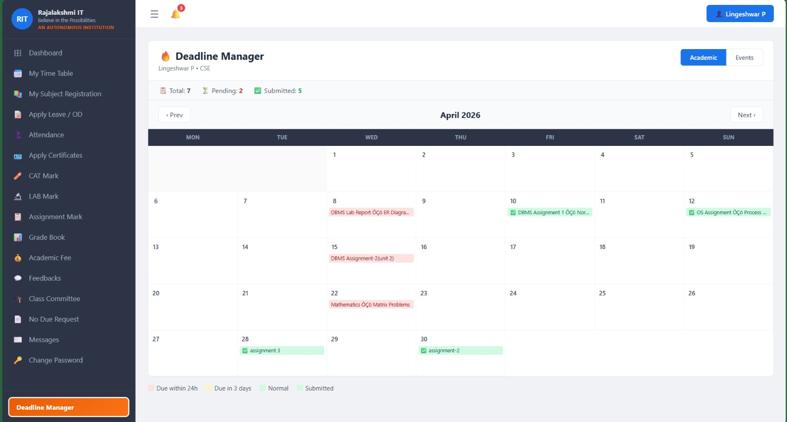
    </td>
    <td align="center">
      <b>🗓️ Events Calendar</b><br><br>
      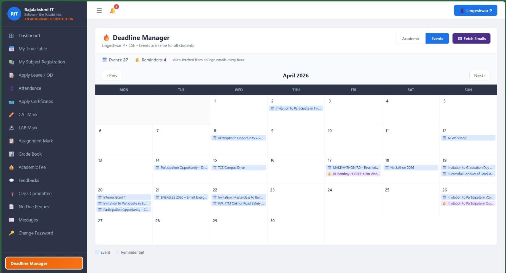
    </td>
  </tr>

  <tr>
    <td align="center">
      <b>🔔 Event Reminder</b><br><br>
      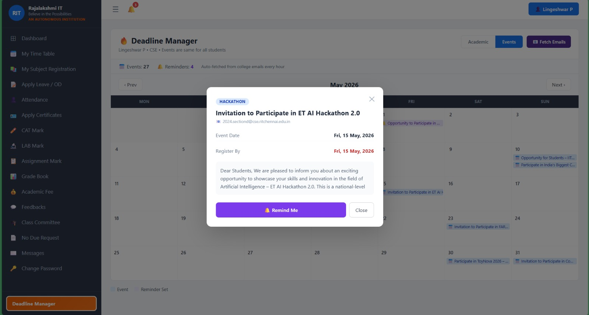
    </td>
    <td align="center">
      <b>📚 Moodle Student Homepage</b><br><br>
      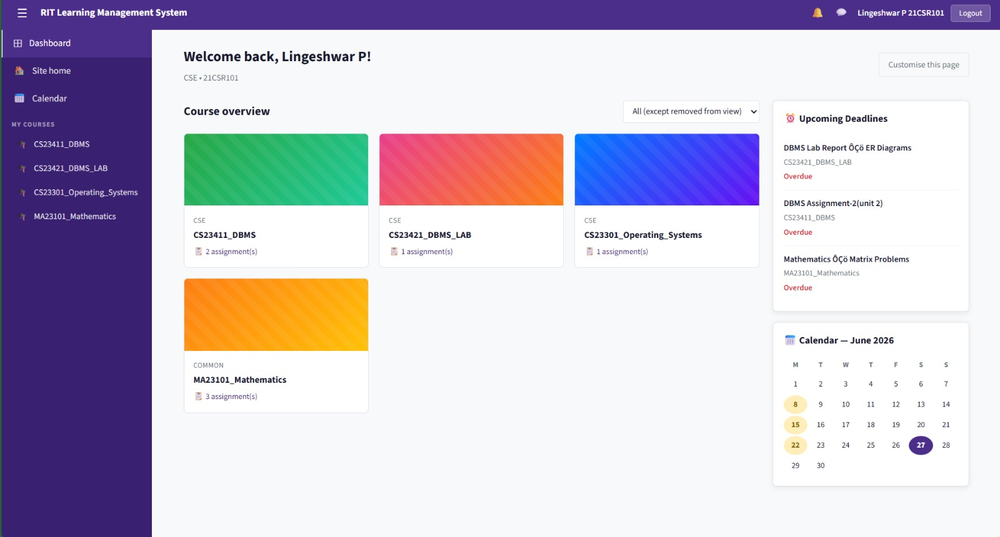
    </td>
  </tr>

  <tr>
    <td align="center">
      <b>📝 Moodle Assignment Page</b><br><br>
      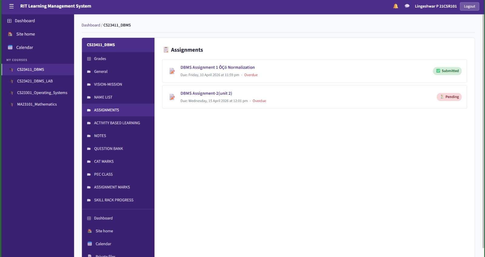
    </td>
    <td align="center">
      <b>📤 Assignment Submission</b><br><br>
      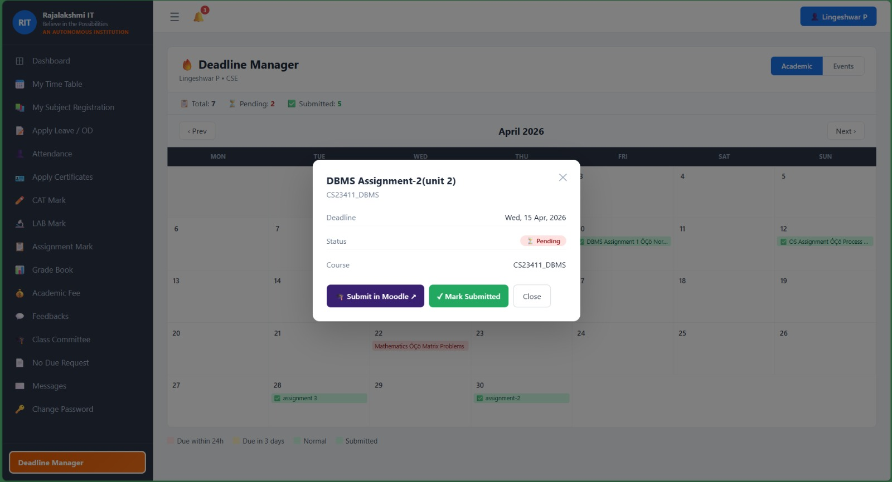
    </td>
  </tr>

  <tr>
    <td align="center">
      <b>✅ Moodle Student Submission</b><br><br>
      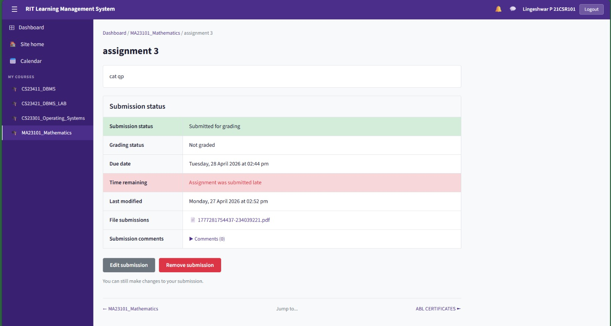
    </td>
    <td align="center">
      <b>👨‍🏫 Moodle Faculty Homepage</b><br><br>
      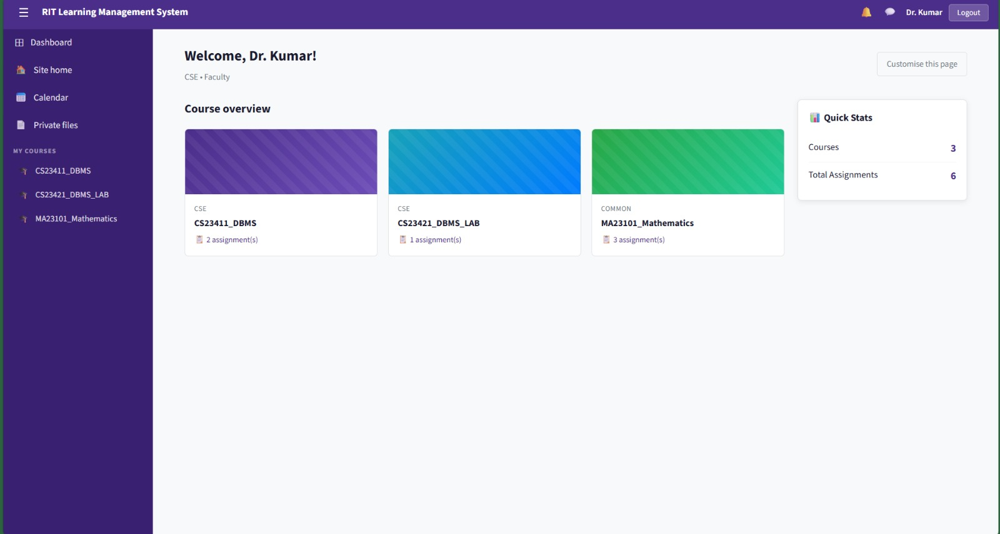
    </td>
  </tr>

  <tr>
    <td align="center">
      <b>📖 Moodle Faculty Subject</b><br><br>
      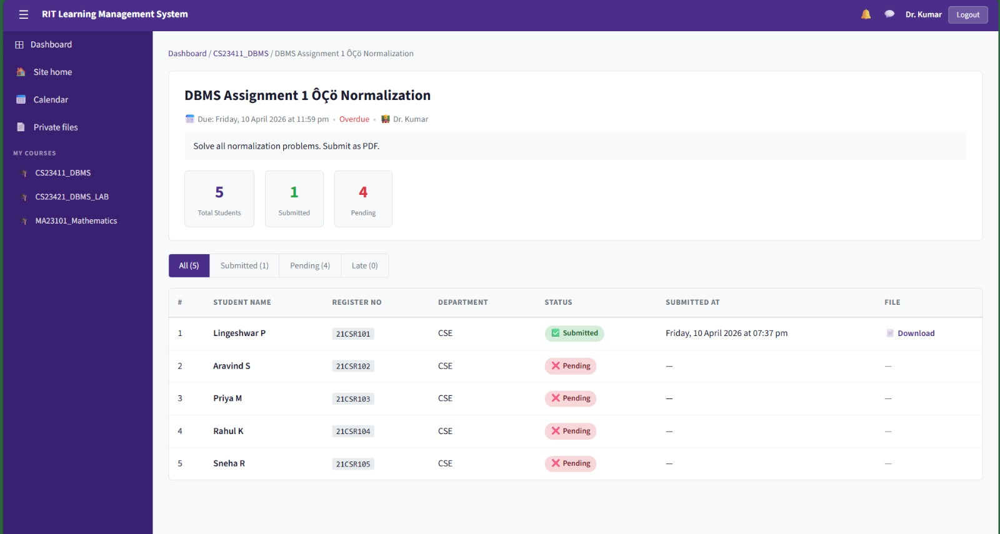
    </td>
    <td align="center">
      <b>📊 Moodle Faculty View</b><br><br>
      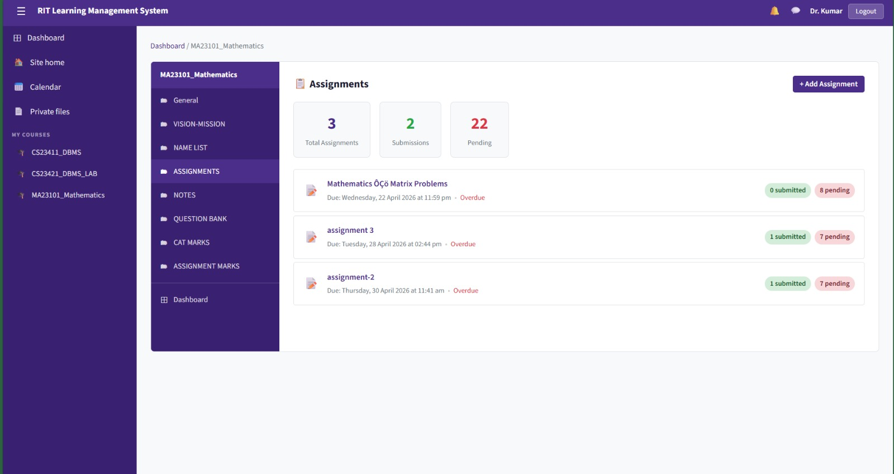
    </td>
  </tr>

  <tr>
    <td align="center">
      <b>🔑 Moodle Login</b><br><br>
      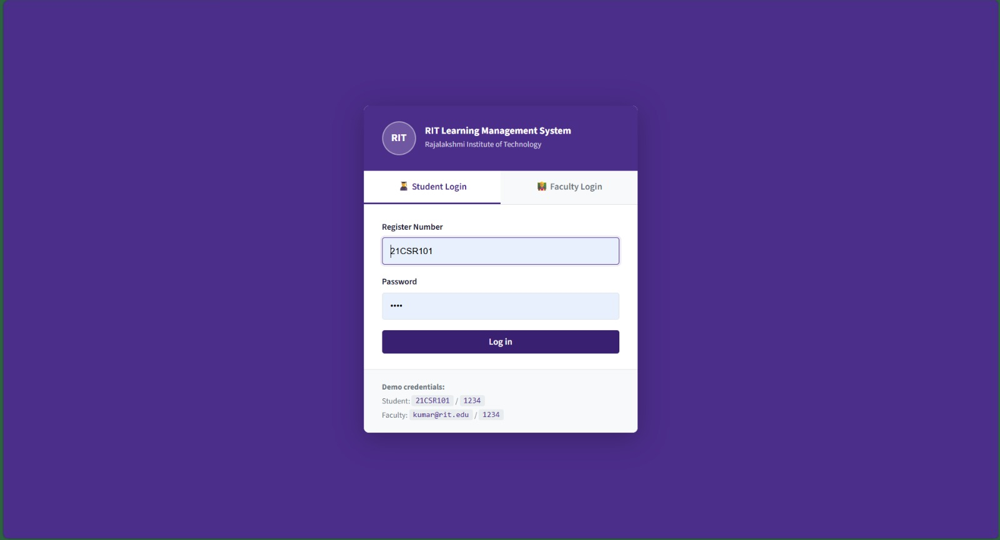
    </td>
    <td align="center">
      <b>💬 WhatsApp Reminder</b><br><br>
      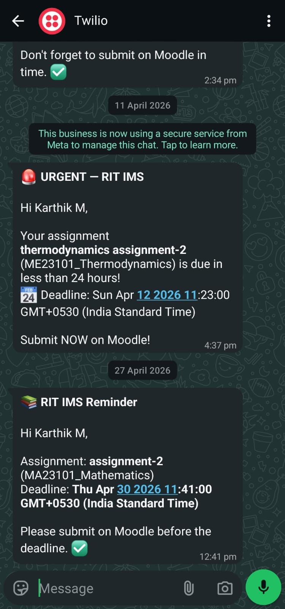
    </td>
  </tr>
</table>

## 🎥 Demo Video


[▶️ Watch the full demo](https://drive.google.com/file/d/1qwtqGlF-VJTBEYuyqEw2OnV50sHVl2mC/view?usp=sharing)

---

## 📄 License

This project is licensed under the [MIT License](LICENSE).

---

## 🏁 Conclusion

RIT Smart IMS demonstrates how a shared-database architecture can eliminate the synchronization overhead typically found in multi-system academic platforms. By combining a department-aware IMS, a role-based LMS, and an automated email-to-event pipeline, the project delivers a connected experience where assignment data, academic records, and event notifications stay consistent without manual upkeep. The system was built end-to-end — from database design to third-party API integration — as a practical exploration of full-stack engineering applied to a real institutional problem.
